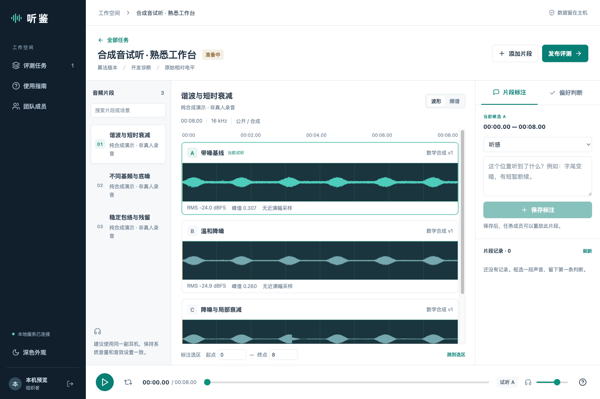

# 听鉴 · 音频算法评测工作台

把同一段声音的不同算法输出放在一起试听，将判断保存为可重放的片段证据。

**0.5 开发预览版**：本机或局域网运行，浏览器参与，音频和评测数据保存在服务主机。仓库只包含代码和数学合成素材的生成器，不包含任何真实录音、模型、账号或运行数据库。



## 已实现

- AIBF、VPU 降噪/生成模型、级联各级输出、自研与竞品的多版本导入；算法与整机比较分别标识。
- 版本目录匹配预览、逐片段原子批量导入、暂停与重试；草稿候选名称/版本修改及删除保护。
- 同一音频时钟上的最多 6 路预加载播放，切换不重启播放头，选区循环、快捷键、公共监听音量。
- 同轴波形、固定色阶频谱；16 kHz、PCM/浮点 WAV；支持单通道和 4 通道的显式通道选择。
- 时间区间评论、问题标签、按楼层聚合的评论回复、草稿恢复、点击记录回到对应候选和片段。
- 草稿任务与片段信息可修正；进行中的任务可增补成员，未贡献记录的参与者可移出。
- 管理员、组织者与评测者账号；组织者可上传并管理自己的任务，任务删除进入可恢复的回收站。
- 任务分配、发布冻结、隐藏候选身份、独立偏好提交、统一关闭揭晓。
- 关闭后的结果复盘：受邀评测进度（已完成/进行中/未开始，收集期间管理者可查完成状态）、逐片段偏好票数与分母、分歧提示回跳片段、问题标签汇总；JSON／CSV／Markdown 三种证据导出、包含音频的完整备份与离线恢复。
- 中文界面、深浅主题、窄屏布局；内网运行不依赖 CDN 或外部账号。

两候选时可作探索性 A/B 偏好比较；多候选时为自定义偏好选择，**不是标准 MUSHRA，也不是 ABX**。

## 分角色使用指南

点击软件左侧“使用指南”，默认打开当前账号角色的手册，可切换管理员、组织者和评测者，按章节阅读或搜索关键词。指南离线可用，并支持下载包含所有角色的完整 Markdown 手册。

也可直接阅读 [分角色使用手册](docs/分角色使用手册.md)，涵盖部署、账号授权、共享目录上传、发布冻结、独立听评、标注、结果解读、回收站、升级恢复与常见问题。

## 快速体验

### 使用 Windows 构建包

在本仓库 [Releases](https://github.com/bridgoon97/audio-eval-workbench/releases) 下载对应版本的 Windows ZIP 并完整解压；开发构建也可从成功的 Actions 运行下载 `audio-eval-windows-latest` 产物。双击 `audio-eval.exe`，不要单独移动 exe，旁边的 `_internal` 目录必须保留。构建包未经代码签名，按所在组织的软件运行策略处理。

启动窗口显示本机访问地址和首次初始化密钥。浏览器中填写密钥并创建管理员（密码至少 10 个字符），然后点击“创建合成音演示”熟悉操作。示例为纯数学合成音，不是真人录音或算法效果证明。

具体构建是否可用以对应 Actions 运行结果为准。CI 启动检查不等于真实耳机、企业网络或同事使用验收。

### 源码启动

使用 **uv 管理 Python 版本、项目环境和依赖锁定**，Node.js 22 或更高用于构建前端。前端构建完成后，日常服务不需要 Node.js。先按 [uv 官方安装说明](https://docs.astral.sh/uv/getting-started/installation/) 安装 uv。

Windows PowerShell、macOS 和 Linux 共用以下命令：

```bash
git clone https://github.com/bridgoon97/audio-eval-workbench.git
cd audio-eval-workbench
uv sync --locked
npm ci
npm run build
uv run --locked audio-eval
```

`.python-version` 固定 Python 3.13 系列，`pyproject.toml` 声明依赖和开发依赖组，`uv.lock` 锁定跨平台解析结果。`uv sync --locked` 自动建立项目 `.venv` 并检查锁文件；CI 使用同一锁文件。添加依赖用 `uv add`，开发依赖用 `uv add --dev`，应用版本可用 `uv version` 更新；Git 负责代码历史。

默认只监听 `127.0.0.1:8765`，数据位于当前用户的 `.audio-eval-workbench`，可用 `--data` 指定其他本机目录。开发热更新用 `npm run dev`，Python 服务仍需单独运行。

## 发布一次团队评测

1. 管理员在左侧“团队成员”创建账号。需要创建/上传任务的同事选择“组织者”，只参与听评的同事选择“评测者”。
2. 新建任务，选择开发诊断或隐藏版本模式；后者发布后不显示真实名称、指标或频谱。
3. 点击“批量导入”，按版本选择目录并确认匹配预览；或添加片段，逐个导入 2–6 个候选 WAV。候选需来自同一输入和时间范围；首版最多 120 秒、32 MB、16 kHz。
4. 检查波形、体检数字和处理来源。4 通道默认映射为 FB / FF / TT / VPU，导入时明确选择，不自动猜测。
5. 发布前确认时间对齐及增益处理、选择评测者。发布后输入和协议冻结；进行中仍可增补成员，已有评论或评分的人不能移出。新增版本请创建新任务。
6. 同事独立提交偏好并记录问题。隐藏模式下，收集期间组织者也无法通过评测接口查看他人的意见，仅能通过“评测进度”查看受邀同事的完成数量与状态。
7. 关闭收集并统一揭晓，点击时间评论复盘；打开“查看结果”查看参与进度、逐片段偏好、分歧提示与问题标签，并导出 JSON／CSV／Markdown。

管理员有主机/数据库控制能力，因此不要将此模式宣称为对组织者也不可知的完整双盲实验。候选名称、元数据与 URL 已避免直接泄露身份，音频本身仍可能让熟悉版本的人辨认。

## 批量导入示例

在“准备中”任务点击“批量导入”，分别选择 `AIBF-v1/`、`AIBF-v2/` 和 `竞品/`。每个目录内部按同样的结构保存 `室内/001.wav`、`车内/002.wav`，软件把相同相对路径组成一道题。根目录名可以不同，内部路径区分大小写；同名但不同子目录的音频不会混在一起。

选择目录仅在浏览器内生成匹配预览，点击确认后才上传 WAV。填写每个版本的名称、版本证据和通道，以及本批场景/数据来源。缺失、重名、超过 32 MB 或任务内已有的片段会标明并跳过；服务器进一步验证采样率、通道、长度和有效数值。文件名相同与长度相同都不能替代人工同步检查。

每次只上传一个片段的全部候选，校验失败不会留下半道题。暂停等待当前片段完成；本窗口可继续或重试，重复请求不重复建题。刷新后重新选目录会跳过已存在片段。失败片段需要修改输入时，关闭并重新打开导入窗口。已导入片段保留，不执行整批回滚。

草稿候选右侧“管理”可修改名称/版本证据或确认删除。已针对候选或整段音频写下标注时，相关音频保留；发布后接口拒绝修改和删除。删除仅解除草稿引用，不立即清理共用音频文件，避免影响其他任务；备份只包含仍被引用的音频。

## 同事创建和上传任务

管理员打开“团队成员”，将现有同事的角色改成“组织者”，或创建新账号时选择该角色。同事在线网页约 5 秒内会自动同步并显示“新建评测”；创建任务后可逐个上传或按版本目录批量导入，再邀请已有账号参加。组织者只能管理自己创建的任务，管理员可以管理全站任务；评测者仅参与分配给自己的任务。组织者无账号管理权限，也不能下载含全站数据的备份。

Windows 共享目录权限负责让同事读到源音频；网页角色负责能否创建评测任务，二者独立。同事可以在浏览器的文件/目录选择器中选择有权读取的共享文件夹（例如映射的网络驱动器），随后上传到服务主机。读取源文件只需读权限；软件不直接读取同事输入的服务器路径，也不修改源文件。上传后保存独立试听副本，之后修改共享文件不会替换已经导入的音频。

账号降回“评测者”后，已有会话立即失去创建和管理权限；其任务仍保留，可由管理员管理。网页菜单自动同步，也可点击顶部“同步”。

## 自动生成密码与版本核对

“团队成员”默认生成 24 字符随机密码，可重新生成或自行填写。账号创建成功后可复制包含登录地址、账号和密码的凭证卡；从主机回环地址访问时，先把“同事登录地址”改成实际局域网地址。HTTP 剪贴板受限时支持手动选择复制。关闭窗口后不再显示明文，生成的密码不写入浏览器本地存储，服务端只保存加盐哈希。

成员行的“重置密码”会先显示随机密码预览，输入完整账号名确认后才生效；撤销该同事的所有旧登录会话，保留角色、任务和评测记录。只允许管理员重置非管理员账号，不提供原密码查询或免密链接。

更换 exe 前务必停止旧程序，关闭浏览器不会退出服务。新版先占用端口，只有服务启动成功才打开浏览器；端口已占用时明确报错。顶部“服务信息”提供服务版本、页面版本、运行实例和数据编号，管理员还可查看数据目录。对比管理员与同事的数据编号，可以排查连到不同数据目录的问题。页面与服务版本不一致时会提示重新加载。

角色、可见任务、发布/关闭状态与片段记录每 5 秒自动同步，切回网页或点击“同步”也会更新；后台隐藏页切回后同步。同步保留未提交评论和选区，不重启相同候选的播放。若任务被移除或权限丢失，则退出该任务。旧版页面需要先刷新以加载此机制。

## 删除和恢复任务

打开自己有管理权限的任务，点击“删除任务”，输入完整任务名称确认。草稿、正在评测和已揭晓任务均可移入回收站。移入后所有成员立即失去网页/API/音频访问及提交权限，首页不再显示该任务。

任务首页底部“回收站”可恢复自己有权管理的任务。恢复保留原有状态、成员、音频、标注和评分；恢复已发布任务不会解除输入冻结。当前不提供永久清除，回收站不释放磁盘空间，完整备份也包含其中的数据。

从 0.2 升级：先下载完整备份，退出旧服务，将 0.3 解压到新的程序目录，使用原来的 `--data` 目录启动，同事刷新网页即可。启动时自动添加回收站表，不修改原有任务记录。升级后不要用旧版启动同一数据目录，旧版不识别回收站权限；需要回退时使用升级前备份的独立副本。

## 局域网部署

```powershell
.\audio-eval.exe --lan --data D:\音频评测数据
```

源码启动时使用 `uv run --locked audio-eval --lan --data D:\音频评测数据`。

- 在 Windows 上通过 `ipconfig` 确认实际网卡 IPv4。同事浏览器访问 `http://主机IP:8765`。
- 为本程序或 TCP 8765 建立仅允许所需网段的入站规则，使用实际网络配置文件。公司托管策略需要 IT 配置时，由 IT 处理，不关闭防火墙。
- 文件夹共享权限与网页账号权限独立；同事无需拥有音频目录读写权限，也不应直接共享写入数据库。
- 默认 HTTP 适合本机开发和获准的可信局域网试用，不加密账号和音频传输。正式受限数据部署使用组织批准的 HTTPS 反向代理，以 `--public-origin https://实际内部域名` 指定确切外部源（自动启用安全 Cookie）。代理到本机 HTTP 服务；无需信任任意转发头。部署前核验同源写入与安全 Cookie。程序不自动配置证书或反向代理。
- 主机保持开机，睡眠或退出服务会中断访问。长期开启请安排固定地址、开机启动和一致性备份。
- 音频会发送到拥有试听权限的同事电脑；禁用下载按钮不能防止复制。按数据来源决定谁可以加入任务。

[微软防火墙说明](https://learn.microsoft.com/en-us/windows/security/operating-system-security/network-security/windows-firewall/configure) · [ipconfig](https://learn.microsoft.com/en-us/windows-server/administration/windows-commands/ipconfig)

## 播放与统计口径

- 原文件内容哈希和元数据保存，试听使用去除原文件命名信息的浮点 WAV；不做峰值、RMS 或响度归一化。
- 界面的音量是所有候选共用的监听增益，不能独立抬高某一候选。
- 切换使用统一 8 ms 增益过渡；瞬态判断请重播完整选区，不把切换过渡区作为效果证据。
- 浏览器可能按音频设备采样率重采样；软件逻辑同轴不等于物理设备的位精确输出。
- 频谱为 512 点 FFT、480 点 Hann、160 点 hop、窗起点时间口径；显示时压缩时间分辨率，不能代替高精度测量。横向共用 −100～0 dB 色阶。
- 长度相同不能证明同步。首版需要组织者外部核验恒定延迟与漂移，不自动校正。
- 无干净参考不能报告“恢复正确”。不同设备采集是整机对比，不能把差异单独归因于算法。
- 汇总只显示逐片段原始计数；百分比以该片段的有效提交人数为分母（每人每片段至多一票），缺失判断、评论和回复不计入。分歧表示同一片段出现两种及以上不同偏好，仅用于定位重听，未计算显著性、总体 MOS 或 MUSHRA 得分，也不把帧数当成独立样本数。受邀名单来自评测分配；负责人自动拥有访问权限，但不自动成为受邀评测者。只有受邀评测者的评分计入结果，负责人若要参与，在发布或受邀名单中勾选自己。完成度分为已完成（全部片段）、进行中（部分片段）与未开始。

## 保存与恢复

评论点击保存后写入主机；未提交文字草稿暂存在当前浏览器，草稿不含完整候选、选区和回复元数据，恢复后请重新核对选区。评分提交后锁定，相同请求可安全重试；修正意见写入评论。

管理员在任务首页下载完整备份，其中包含音频、账号口令哈希和任务数据，**按最严格的所含数据权限保管**。备份清除登录会话。停止服务，将备份解压到一个新目录，以 `--data 新目录` 启动；不要直接覆盖运行中的数据库。恢复后重新登录并抽查片段。

## 当前限制与后续

- 已实现的是开发预览闭环，不宣称整个初步计划已经验收。
- 批量导入按完整相对路径精确匹配，尚无手动拖拽映射、任意采样率转换、整题删除和任务修订 UI。
- 评测顺序中候选按人随机且稳定；尚无平衡题序、重复题协议、正式练习题或统计置信区间。
- 尚无自动延迟/漂移检查、响度匹配模式、算法 diagnostics、回归集和模型运行适配器。
- 尚无密码自助修改/重置、账号停用、自动 HTTPS、后台服务安装和自动备份计划。
- 备份在内存中生成；首版针对短样本和小团队，不适用于大量长录音。上传限制按单文件读取执行，不将其视为面向不可信公网的完整资源防护。
- 不建议直接暴露公网；没有公网托管、端口转发或云端上传需求。
- Windows 打包、API 测试和浏览器测试由 CI 运行；实体声卡、公司防火墙和不同听众设备仍需实际验证。

## 开发与验证

```bash
uv run --locked pytest -q
npm test
npm run build
npx playwright install chromium
npx playwright test
uv run --locked python scripts/package.py
uv run --locked python scripts/package_smoke.py
```

浏览器测试使用独立临时目录和端口 8877，由 `uv run --locked` 启动。打包测试使用 8878。测试覆盖授权、匿名元数据、版本冻结、真实音频增益、篡改检测、10 人并发提交、备份恢复和真实 Web Audio 渲染；含 1 采样错位变异检查。

代码结构：`workbench/` 为 Python API 与音频处理；`src/` 为 React/TypeScript 界面与播放引擎；`tests/`、`e2e/` 为验证；`scripts/` 为跨平台打包与独立测试入口。

参照：[Web Audio](https://www.w3.org/TR/webaudio-1.0/) · [ITU-R BS.1534](https://www.itu.int/rec/R-REC-BS.1534/en)

指南内容维护：修改 `src/guide-content.json` 后运行 `uv run --locked python scripts/build_guide.py` 同步仓库手册；内置阅读与下载直接使用同一份内容。
